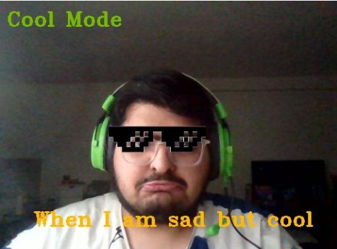

# Filtomatic: Real-Time Video Special Effects

This project is a C++ application that applies a variety of special effects to a live video feed in real-time using OpenCV.



## 📸 Project Description

This application provides a collection of live video filters. You can apply a variety of artistic and computational filters to your webcam feed, from classic grayscale and sepia tones to more complex edge detection and face-based effects. The project also includes features for creating memes and recording video clips.

## ✨ Features

Explore a wide range of filters and effects that can be applied to your live video stream:

  * **Color & Tone:**

      * **Grayscale:** Go classic with a black and white look.
      * **Sepia:** Add a warm, brownish vintage tint.
      * **Alternate Grayscale:** Try a different take on grayscale with a three-channel implementation.
      * **Blur-Quantized:** Create a posterized effect by blurring and reducing the number of colors.

  * **Artistic & Stylized:**

      * **Blur:** Soften the image with a 5x5 Gaussian blur.
      * **Emboss:** Give the video a raised, 3D appearance.
      * **Pencil Sketch:** Transform your video into a hand-drawn sketch.
      * **Cartoon:** Apply a fun, cartoonish look to your video feed.

  * **Computational & Edge Detection:**

      * **Sobel X & Y:** Detect and visualize horizontal and vertical edges in the video.
      * **Gradient Magnitude:** See the combined magnitude of the edges detected by the Sobel filters.

  * **Face-Based Effects:**

      * **Face Detection:** Automatically detect faces and draw a bounding box around them.
      * **"Cool Mode":** Put on some cool shades\! This effect detects your eyes and overlays a pair of "deal with it" glasses.

  * **Utilities & Fun:**

      * **Mirror:** Flip the video horizontally for a mirrored view.
      * **Meme Generator:** Add your own custom text to the video to create memes on the fly.
      * **Video Recording:** Record and save snippets of your filtered video.

## 🚀 Getting Started

To get a local copy up and running follow these simple steps.

### Prerequisites

  * C++ compiler
  * OpenCV
  * CMake

### Installation

1.  Clone the repo:
    ```sh
    git clone https://github.com/adnanamir010/filtomatic.git
    ```
2.  Build the project using CMake.

## 💻 Usage

Once the project is built, run the executable to start your webcam feed. You can then use the following keys to toggle various filters and features:

  * **`h`**: Apply the alternate grayscale filter.
  * **`w`**: Add or remove a caption with the meme generator.
  * **`r`**: Start recording a video.
  * **`t` or `q`**: Stop the recording or quit the application.